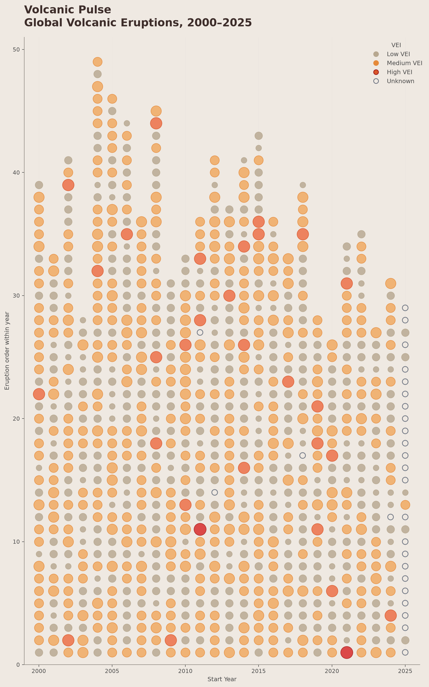

# Volcanic Pulse



## The phenomenon

Volcanic eruptions are natural events caused by magma, gas, and other materials moving from inside the Earth to the surface. I chose volcanic eruptions because I have always been interested in volcanoes and wanted to explore how their activity could be translated into a visual rhythm rather than shown only as numbers in a table.

This project focuses on global volcanic eruptions from 2000 to 2025. I originally explored a longer period from 1960 to 2025, but the result became visually crowded. I therefore narrowed the time range to 2000–2025 so that individual eruptions and differences in eruption intensity could be seen more clearly.

## The source

The data comes from the Smithsonian Institution Global Volcanism Program (GVP), using the official Confirmed Holocene Eruptions dataset from *Volcanoes of the World*.

Source: [Smithsonian Global Volcanism Program — Confirmed Holocene Eruptions](https://volcano.si.edu/search_eruption.cfm)

The original file used in this project is:

`data/GVP_Eruption_List_Holocene_20260424.xlsx`

The original spreadsheet contains 9,918 eruption records. Each row represents one confirmed volcanic eruption and includes fields such as volcano name, eruption number, VEI, and start and end dates.

For this visualisation, I use eruptions whose `Start Year` is between 2000 and 2025. This produces 941 eruption records. Of these, 27 have no recorded VEI value.

VEI means Volcanic Explosivity Index. It is an index used to describe the relative explosiveness of volcanic eruptions.

## What the picture shows

Each circle represents one volcanic eruption.

The horizontal axis represents the eruption start year. The vertical position represents the order of eruptions within each year, allowing years with more recorded eruptions to form taller columns.

The size and colour of each circle are driven by VEI. Lower-VEI eruptions use lighter, more muted colours, while stronger eruptions become warmer and more visually prominent. Eruptions with unknown VEI are shown as small hollow circles instead of being removed from the dataset.

The image focuses on the rhythm, frequency, and relative intensity of eruptions over time. It does not show the geographical location of each volcano, exact eruption duration, volcano name, or precise start date. These details are deliberately left out so that the visualisation can focus on temporal activity and VEI without becoming too crowded.

## Run it

```bash
uv run fetch.py
uv run plot.py
